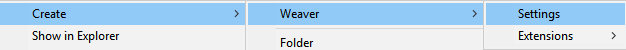
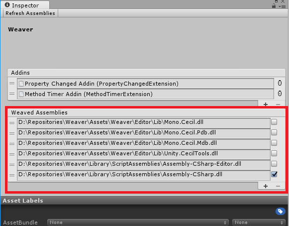
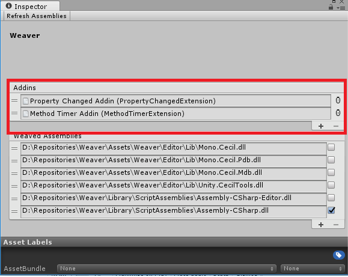

### TODO: Update Docs
Weaver is the last few updates has becomes quite a bit easier to use but these screenshots and comments are out of date.

# Weaver
A a code weaver built for use in [Unity Engine](https://unity3d.com/). Based very heavily off of [Fody](https://github.com/Fody/Fody). Implmented using [Mono.Cecil](http://www.mono-project.com/docs/tools+libraries/libraries/Mono.Cecil/).

### What is Code Weaving?
Weaving refers to the process of injecting functionality into an existing program. This can be done conceptually at a number of levels:

* Source code weaving would inject source code lines before the code is compiled
* IL weaving (for .NET) adds the code as IL instructions in the assembly

A great example of this is the [Unity Project Updater](https://docs.unity3d.com/Manual/APIUpdater.html). It uses both versions of code weaving on your project. It uses text replacing for unsupported code in your source files and IL weaving for compiled dlls.

Weaver for now only uses IL Weaving which runs once every time an assembly is recompiled. 

### Features
* Hooked into Unity callbacks to run automatically. 
* Filter only the assemblies you want to weave. 
* Easy to extend using [ScriptableObjects](https://docs.unity3d.com/ScriptReference/ScriptableObject.html).

## How To Use
Weaver is built using ScriptableObjects as their base so to start using Weaver we need to create a few. First step is to create a Waver Settings. In Unity use the create menu to create a new instance. 

*Right click in the Project Window* `Create/Weaver/Settings`

**Tip:** Try to only have one instance of Weaver Settings in your project as every one will subscribe and execute when assemblies are recompiled. 

#### Target Assmblies
When you create a new instance by default Weaver will not edit any assemblies. It is up to you to define which assemblies you want to be modified. Click on the + icon on the bottom right and a context menu will pop up with all the valid assemblies you can target. You can also disable the assemblies in this list by unchecking the check box beside it's name. 

#### Adding Extensions
To use Extensions you first need to create a new instance of the scriptable object extension you want to use. Then hit the + button and drag that extension index into the list. 

**Tip:** Try to only have one instance of each extension. If you have more then one it's effect will be applied twice which is most likely not what you want. 

## Current Extensions
* [**Method Timer**](.//Assets//Weaver//Extensions//MethodTimer//README.md) - Any method with the `MethodTimerAttribute` will be timed using [Stopwatch](https://msdn.microsoft.com/en-us/library/system.diagnostics.stopwatch(v=vs.110).aspx) and logged to the console. 

* [**Profile Sample**]() - Any method with the `ProfileSample` attribute will be have a profile sample injected into the method. The sample name will be the name of the method. 

* [**Property Changed**](.//Assets//Weaver//Extensions//PropertyChanged//docs//README.md) : Invoke a callback whenever a property is marked with the `[OnChanged(string callback)]` attribute.. 

## Meta

Handcrafted by Byron Mayne [[twitter](https://twitter.com/byMayne) &bull; [github](https://github.com/ByronMayne)]

Released under the [MIT License](http://www.opensource.org/licenses/mit-license.php).

If you have any feedback or suggestions for Weaver feel free to contact me. 
