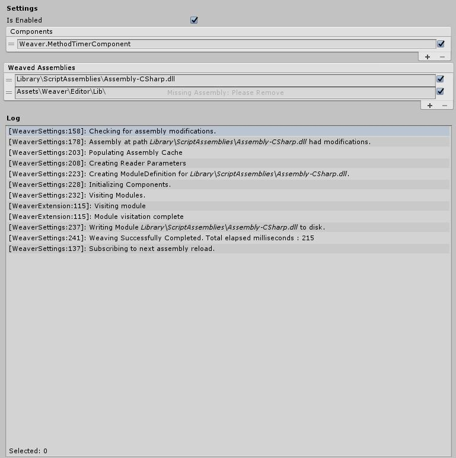
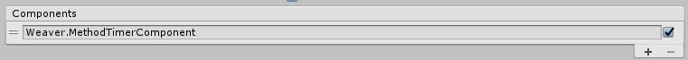
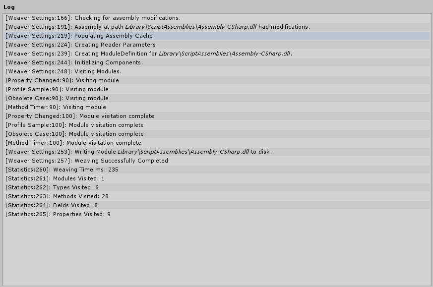

# Weaver
A a code weaver built for use in [Unity Engine](https://unity3d.com/). Based very heavily off of [Fody](https://github.com/Fody/Fody). Implmented using [Mono.Cecil](http://www.mono-project.com/docs/tools+libraries/libraries/Mono.Cecil/).

### What is Code Weaving?
Weaving refers to the process of injecting functionality into an existing program. This can be done conceptually at a number of levels:

* Source code weaving would inject source code lines before the code is compiled
* IL weaving (for .NET) adds the code as IL instructions in the assembly

A great example of this is the [Unity Project Updater](https://docs.unity3d.com/Manual/APIUpdater.html). It uses both versions of code weaving on your project. It uses text replacing for unsupported code in your source files and IL weaving for compiled dlls.

Weaver for now only uses IL Weaving which runs once every time an assembly is recompiled. 

### Features
* Hooked into Unity callbacks to run automatically. 
* Filter only the assemblies you want to weave. 
* Validation for end user.
* Custom logger.
* Utility functions to write MSIL.

## How To Use
Weaver is run using a single ScriptableObjects you will need to create a new instance for your project. Int Unity use the create menu to create a new instance. 

*Right click in the Project Window* `Create/Weaver/Settings`

> **You Only Need One:** Only one instance should exist in your project since every operation only needs to happen once. 

#### Weaved Assmblies

When you create a new instance by default Weaver will not edit any assemblies. It is up to you to define which assemblies you want to be modified. Click on the + icon on the bottom right and a context menu will pop up with all the valid assemblies you can target. You can also disable the assemblies in this list by unchecking the check box beside it's name. This will stop them from being edited.

> **Menu Content:** The assemblies in the menu are populated with reflection and will be found if they they are anywhere ein the Unity Project.

#### Components
Weaver is built around it's components as they are what do the weaving of the assemblies. Weaver itself is just a provider of information for the components. They get notified when they should run and on which assemblies they should run against.

To add a new component use the `(+)` button to open the menu and pick any option. 

> **There Can Only Be One:** You can only have one instance of each component as having more would be useless.

> **Adding New Componet Types:** The component menu uses reflection to find all types that inherit from `WeaverComponent` and are not abstract and are part of the EditorAssembly. Any new calsses that match thoese rules will populate inside the menu.
### Logs

To make the process a bit more clear but also not spam to your console Weaver logs all it's contents to it's own console on the ScriptableObject. Errors are also logged to the Unity console because that is important.

## Current Extensions
* [**Method Timer**](.//Assets//Weaver//Extensions//MethodTimer//README.md) - Any method with the `MethodTimerAttribute` will be timed using [Stopwatch](https://msdn.microsoft.com/en-us/library/system.diagnostics.stopwatch(v=vs.110).aspx) and logged to the console. 

* [**Profile Sample**]() - Any method with the `ProfileSample` attribute will be have a profile sample injected into the method. The sample name will be the name of the method. 

* [**Property Changed**](.//Assets//Weaver//Extensions//PropertyChanged//docs//README.md) : Invoke a callback whenever a property is marked with the `[OnChanged(string callback)]` attribute.. 

### Analytics
I have had some basic analytics to the project to get an idea of what components are being used and any exceptions are being thrown. I only capture the following:
* Computer Name (md5 encoded)
* Product Name + Company Name (md5 encoded)
* Script Count
* Assembly Count
* Platform 
* Unity Version
* Number of members visited
* Weaving Time
* New component added (type name)
* Component removed (type name)
* Exceptions thrown while weaving

I do not capture and send anything besides those values. I mostly use this to get an idea of how well Weaver is doing. I don't have much data on how fast it runs on larger projects.

 All that being said you can remove the Analytics if you want by commenting out `WeaverAnalytics.Send` function.

### Git Sub Modules
* [Capture Groups](https://github.com/ByronMayne/CaptureGroups): Used to generate the screen shots because I am too lazy to do that by hand. All code is under the preproc `CAPTURE_GROUPS` so feel free to remove this if you copy over the code.

## Meta

Handcrafted by Byron Mayne [[twitter](https://twitter.com/byMayne) &bull; [github](https://github.com/ByronMayne)]

Released under the [MIT License](http://www.opensource.org/licenses/mit-license.php).

If you have any feedback or suggestions for Weaver feel free to contact me. 
